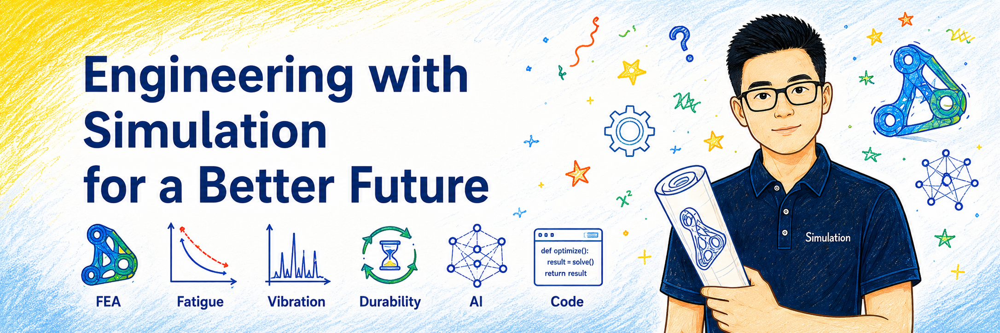
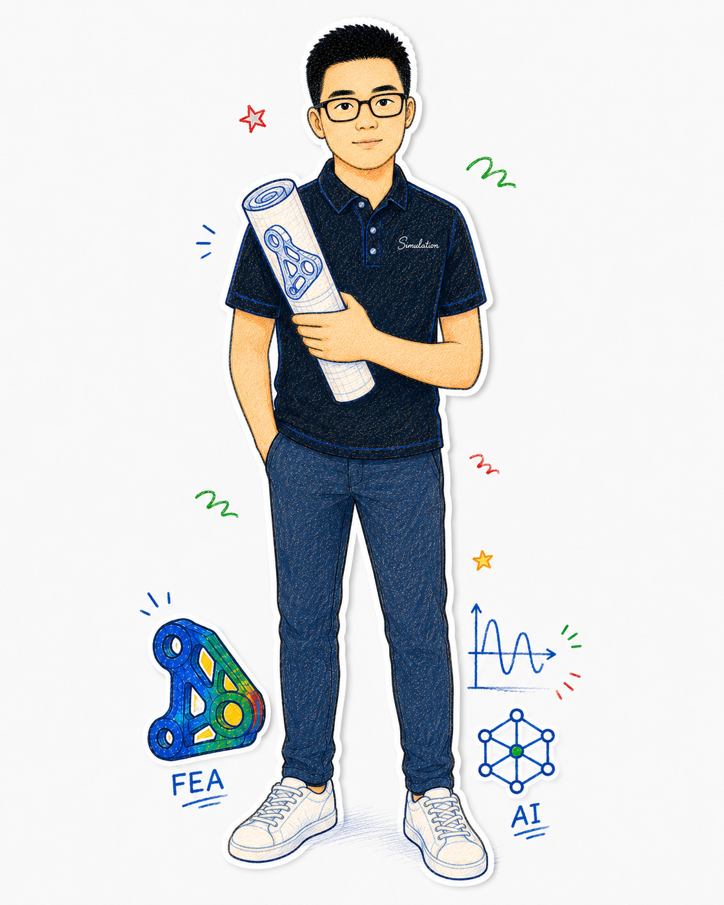
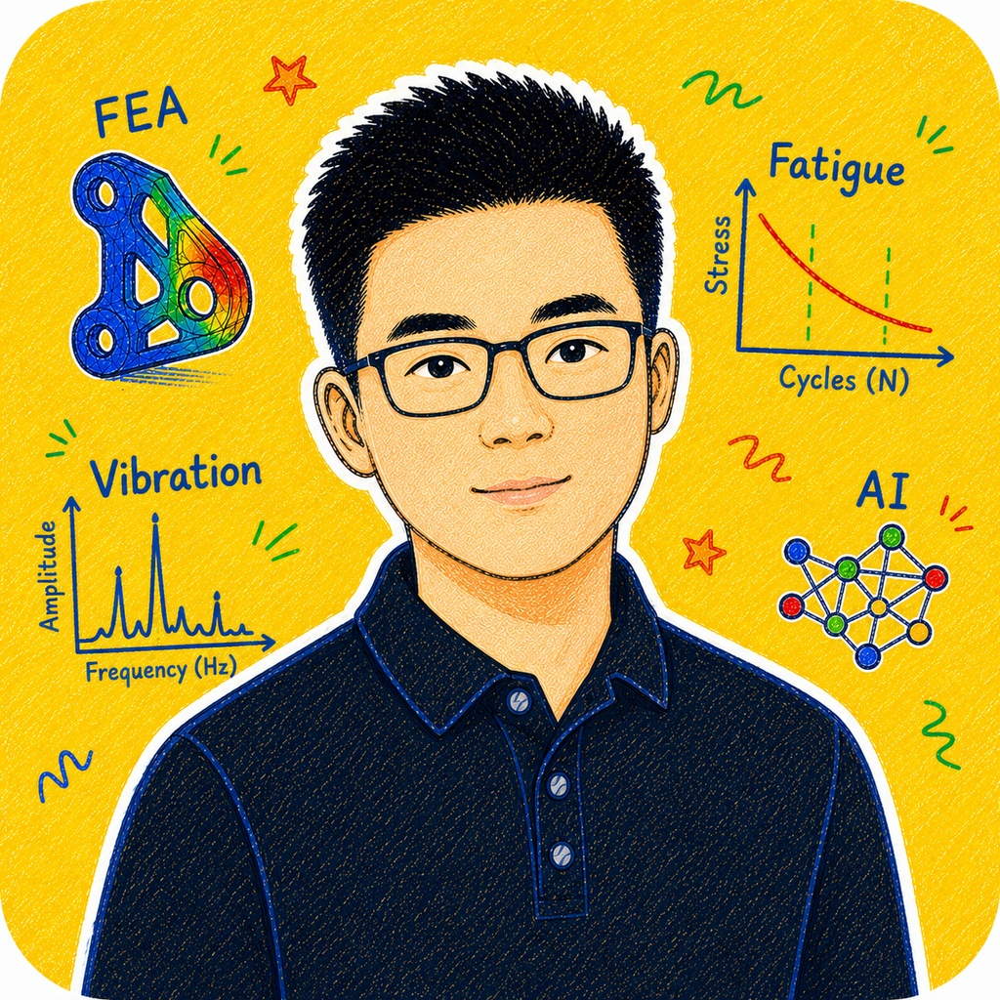
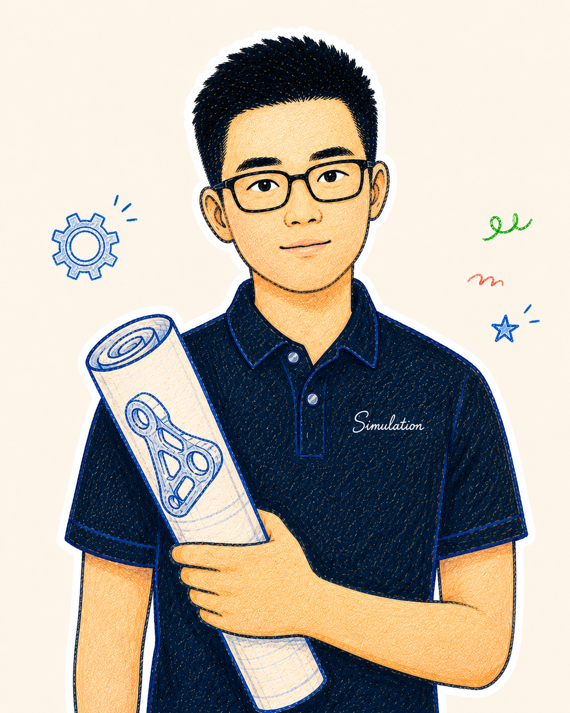
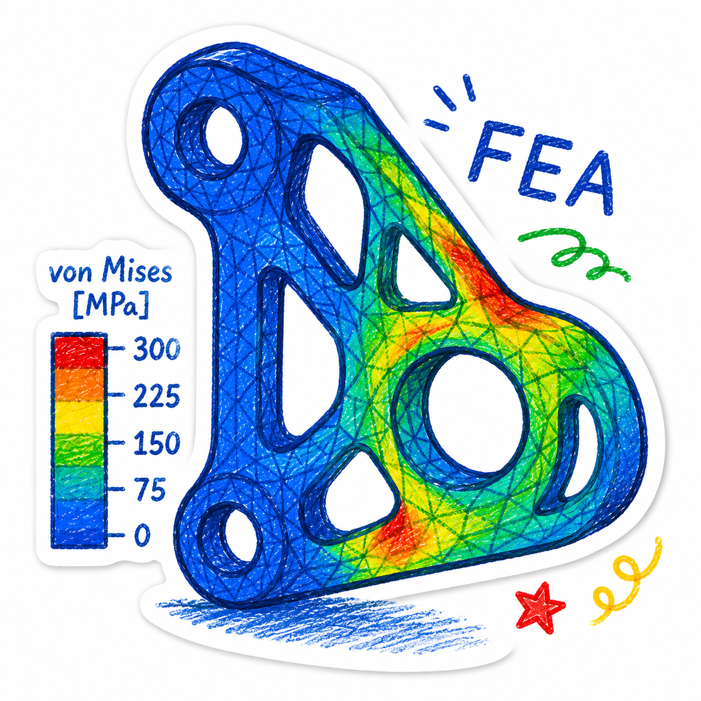
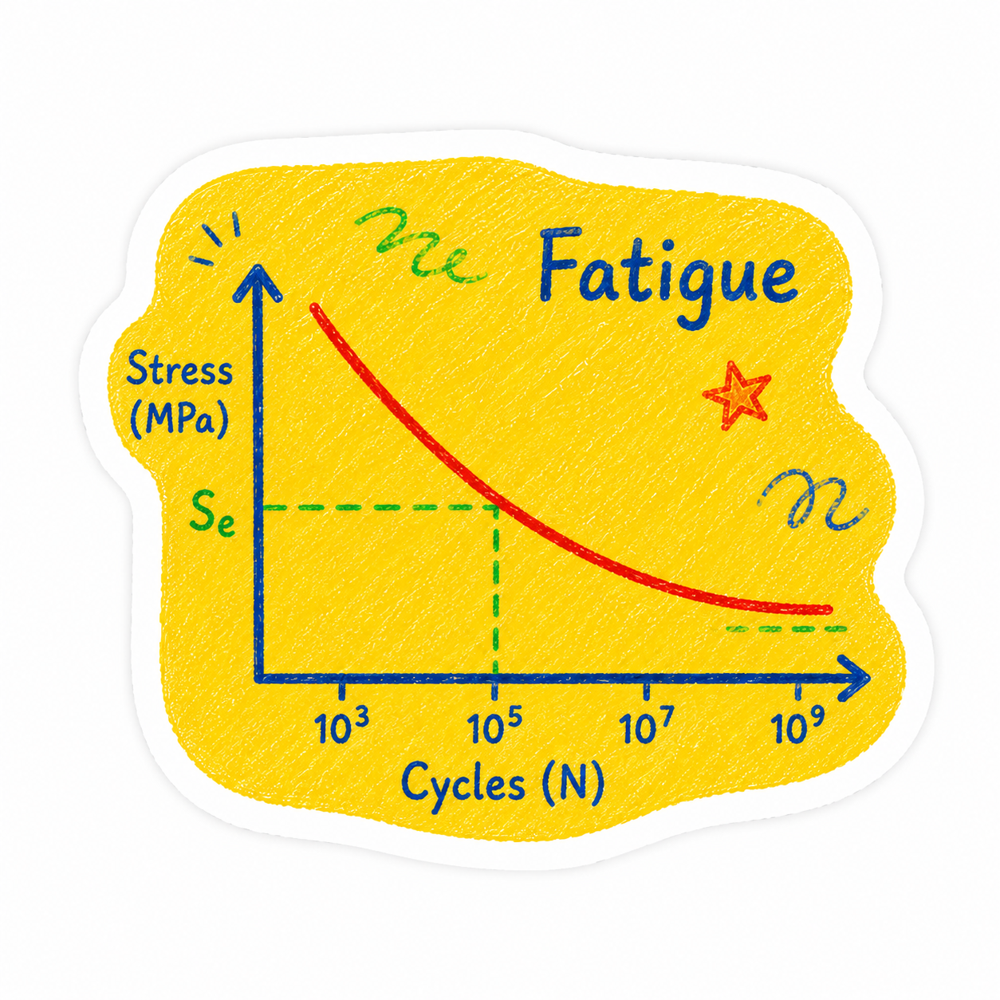
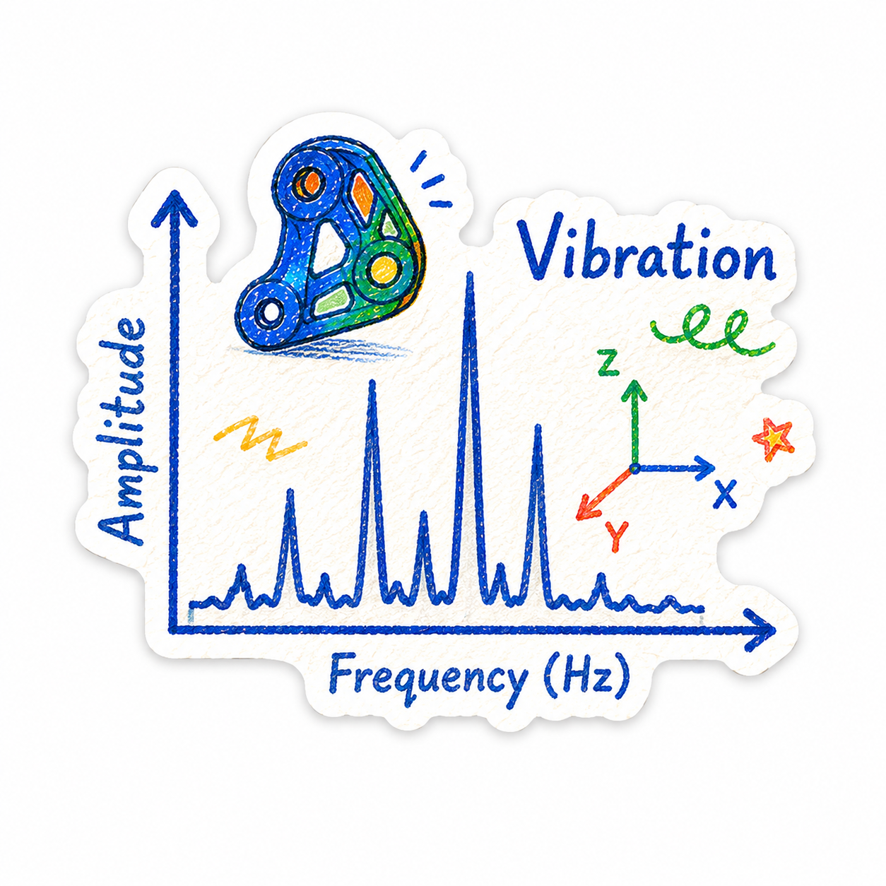
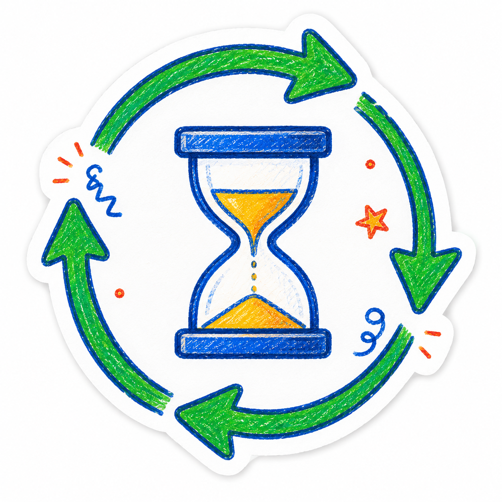
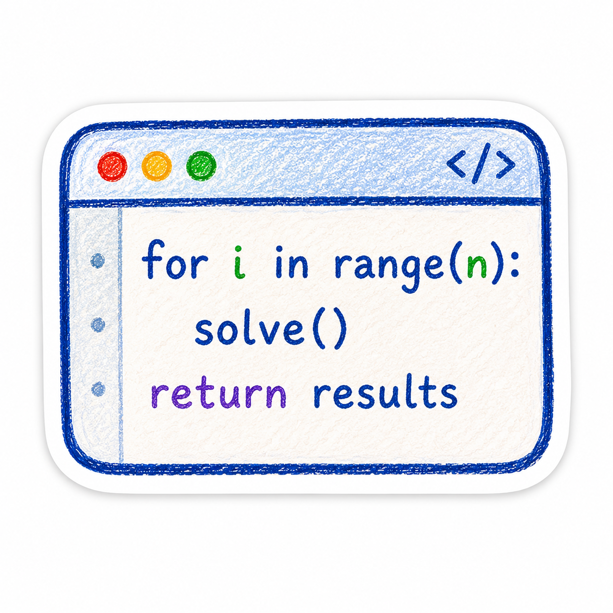
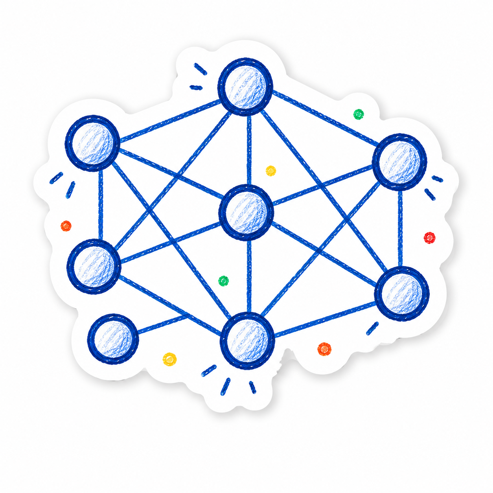

# Johnson Engineering Design System · Brand DNA

## 1. Brand Positioning

Johnson Engineering Design System 是一套面向工程技术内容的个人 IP 设计系统，服务于有限元仿真、疲劳、振动、耐久、代码开发和 AI 辅助工程分析。

它的目标不是做通用科技模板，而是让 Johnson 的工程判断、仿真经验和工具开发能力在网页、PPT、知识卡片和技术说明中拥有统一视觉识别。

## 2. IP Personality

Johnson 的 IP 形象是一个专业、亲和、有工程可信感的力学工程师。

关键词：

- 专业
- 可靠
- 清晰
- 工程化
- 亲和
- 知识传播
- 不花哨
- 不像通用 AI 模板

## 3. Visual Style

核心视觉特征：

- 圆形徽章式工程师 IP
- 手绘蜡笔 / 彩铅质感
- 白色贴纸描边
- 工程蓝主线条
- 明亮黄知识卡片背景
- 科技绿和活力橙点缀
- 工程图标围绕 FEA / Fatigue / Vibration / Durability / Code / AI 展开

## 4. Brand Colors

| 角色 | 色值 | 用途 |
|---|---|---|
| 主色 工程蓝 | `#1E3A8A` | 标题、按钮、图标、主线条 |
| 辅助 科技绿 | `#10B981` | AI、耐久、通过、正向结果 |
| 强调 活力橙 | `#F97316` | 风险、疲劳、重点提示 |
| 点缀 明亮黄 | `#FACC15` | 背景氛围、贴纸、强调块 |
| 中性 深灰 | `#333333` | 正文、说明文字 |
| 背景 暖白 | `#FEFCF6` | 页面背景 |
| 卡片 白色 | `#FFFFFF` | 内容卡片 |
| 边框 浅灰 | `#E5E7EB` | 分隔、边框 |

推荐 CSS 变量：

```css
:root {
  --color-primary: #1E3A8A;
  --color-secondary: #10B981;
  --color-accent: #F97316;
  --color-highlight: #FACC15;
  --color-ink: #333333;
  --color-bg: #FEFCF6;
  --color-card: #FFFFFF;
  --color-border: #E5E7EB;

  --color-primary-soft: #EFF6FF;
  --color-secondary-soft: #ECFDF5;
  --color-highlight-soft: #FFFBEB;
  --color-accent-soft: #FFF7ED;
}
```

使用比例：

- 工程蓝：标题、按钮、导航、主图标，约 35%
- 明亮黄：背景氛围、重点块、贴纸感，约 25%
- 暖白 / 白色：页面背景、卡片，约 25%
- 科技绿：AI、耐久、通过、正向状态，约 10%
- 活力橙：风险、疲劳、警示、重点标注，约 5%

## 5. IP Assets

### Avatar

- `assets/avatar.jpg`
- `assets/avatar-circle-512.png`
- `assets/avatar-circle-256.png`
- `assets/avatar-circle-128.png`
- `assets/avatar-circle-64.png`
- `assets/avatar-square-512.png`
- `assets/avatar-square-256.png`
- `assets/avatar-square-128.png`
- `assets/avatar-square-64.png`

### Character

- `assets/character.png`
- `assets/character-half.png`
- `assets/character-transparent.png`

### Banner

- `assets/banner-engineering.png`

### Emoji

- `assets/emoji/emoji-like.png`
- `assets/emoji/emoji-think.png`
- `assets/emoji/emoji-coding.png`
- `assets/emoji/emoji-cheer.png`
- `assets/emoji/emoji-idea.png`
- `assets/emoji/emoji-coffee.png`
- `assets/emoji/emoji-question.png`
- `assets/emoji/emoji-done.png`

### Stickers

- `assets/stickers/sticker-fea.png`
- `assets/stickers/sticker-fatigue.png`
- `assets/stickers/sticker-vibration.png`
- `assets/stickers/sticker-durability.png`
- `assets/stickers/sticker-code.png`
- `assets/stickers/sticker-ai.png`

### Outline

- `assets/outline-square.png`
- `assets/outline-half.png`
- `assets/outline/outline-square.png`
- `assets/outline/outline-half.png`

### Dark Mode

- `assets/avatar-dark.png`

## 6. Usage Rules

### 首页 / Hero

优先使用：

```html

```

或：

```html

```

### 作者头像

```html

```

### 半身人物

```html

```

### 技术贴纸

```html






```

## 7. Do and Don't

### Do

- 使用工程蓝作为主视觉
- 使用明亮黄建立知识卡片感
- 使用 Johnson IP 头像提升识别度
- 页面内容结构清晰，有工程可信感
- 技术模块要体现 FEA / Fatigue / Vibration / Durability / Code / AI

### Don't

- 不要使用旧品牌名、旧头像或旧人物描述
- 不要使用通用 AI 蓝紫渐变
- 不要赛博朋克
- 不要照片写实
- 不要把合集图当作单张素材
- 不要使用绝对图片路径
